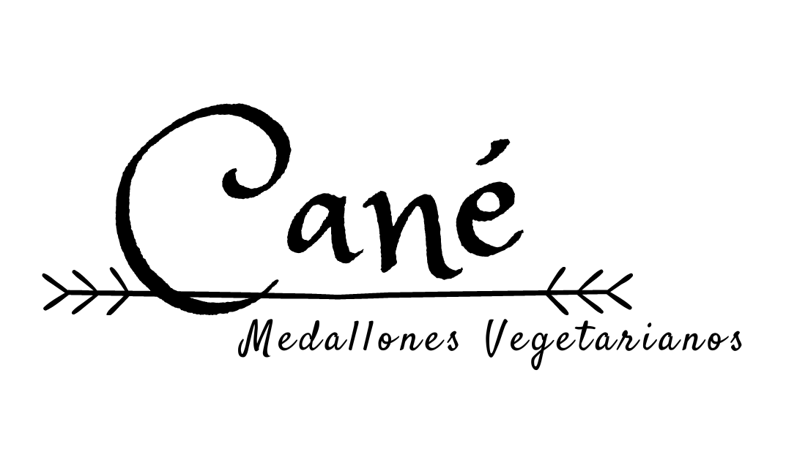
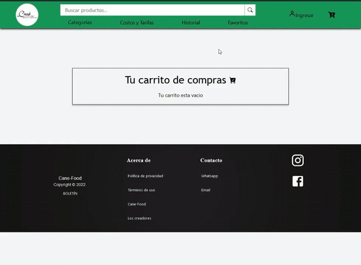
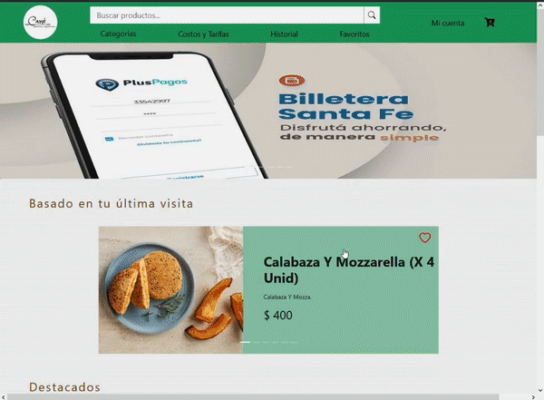
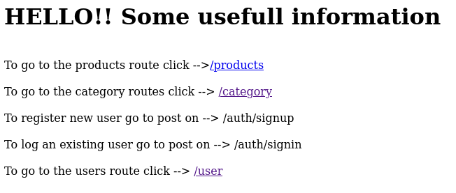
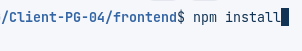
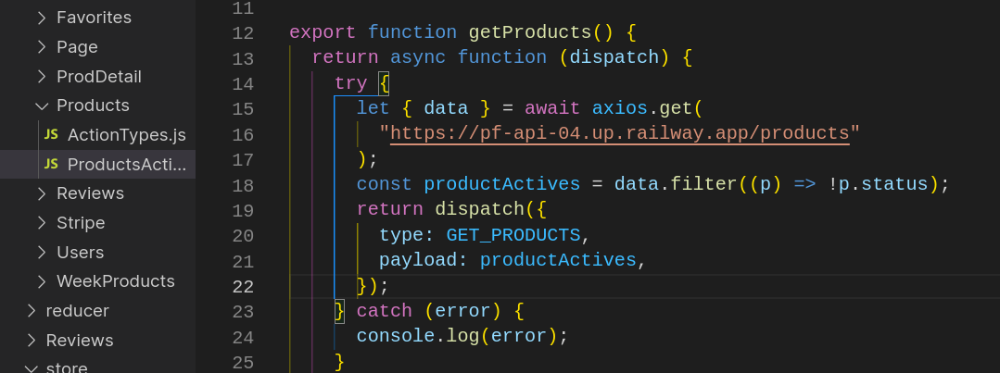
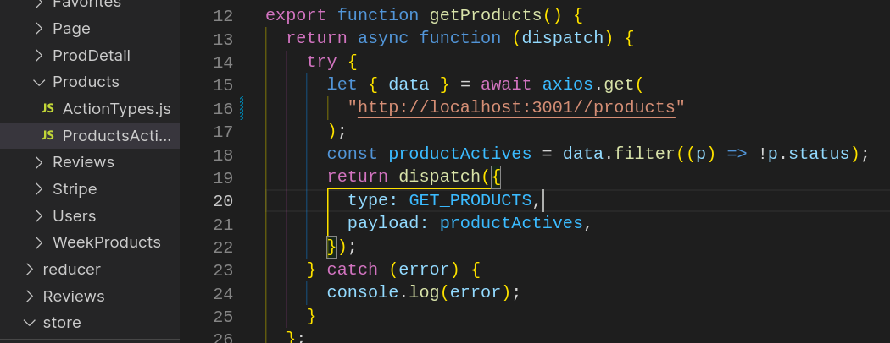
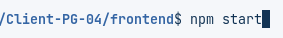

# Cane Food App

Hello everyone! This is the front-end part of Cane Food App. You can see how the app works, his styles and also know a little more about "Cané Medallones Vegetarianos".

### Something about Cane

Cane is a vegetarian food small bussines from Rosario, Argentina. It started at 2014 like a familiar bussines crafting his own products. His personal atention to the customers and high quality did to Cane won a good position and respect in his City.

### Technologies

It was develop with the following technologies:

- React
- Redux
- Ant Design
- Firebase
- Bootstrap

And also, in the most of components has pure CSS to set our personal brand on the project.

---

## How it works?

The complete app has:

- Products section with details and favorite button
- History view and his section to show similar products that match with your last views
- A shop cart that keep your products before buy it, and then you can pay with Stripe
- A sing up / sing in method with Auth0
- A profile section to show your own personal data, history orders, credit cards, and more
- And finally, has a admin dashboard to give the all controls to the admins

### First, we show you how it looks..

You can see a short video about his products, history views section, favorite section and global styles just back here:

### Now, check a look about the login and shop process..

If you want to buy something, first you need an account and login on the app, then you can chose all the products of you want and pay. Let me show you how the flow works:

### After login, you can see your account section..

You can edit you personal data, checks your history orders, credits cards, adress and more. Let's check a look:

### And... what about what the admins can do?

Well, it's simple... If you are admin, you have a special section to control the products, categories, all orders and of course, the users too. Check it for yourself:

---

## What about if I want to run just in my computer?

Ok, we can do it. But, first you need the backend part. Because this is only the front-end part.

### Cloning the back-end

- You need to clone the back-end part (you can find him [here](https://github.com/MVCGCorp/PG-Backend)) and follow their steps to run it.

- If you do all steps in the correct way now you can go to the localhost:3001 and check it. You can see something like this:

### Preparing the front-end

To the run the front-end part you need to follow these steps:

- First you need to clone this repository

- Go to the frontend folder and run -> npm install <- command

- After that you need to go the frontend/src/redux/actions/:name and change every axios method line with the localhost:3001 in all of the :nameAction.js files.

Before:

After:

- And finally, you can run --> npm start <-- command to launch the front-end

### Extra TIP!!

If you don't want to run your personal back-end, you can use our back skipping the step "Cloning the back-end" and the step number 3 on "Preparing the front-end".

## If you want more click [here](cane-food.vercel.app/) and go to the deploy
